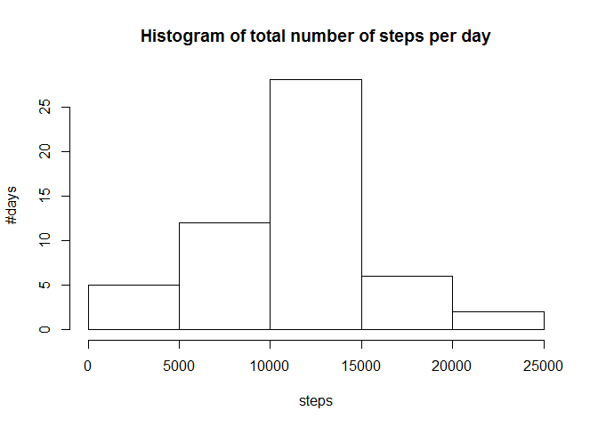
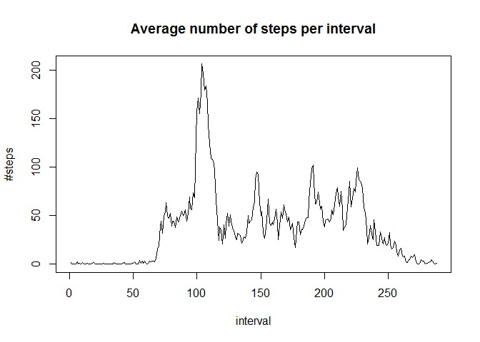
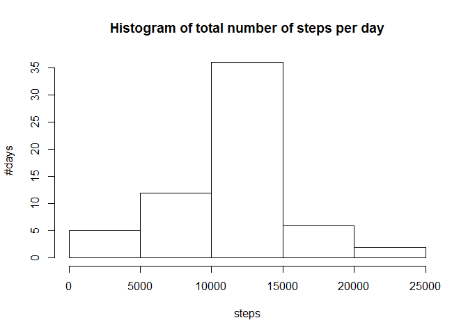
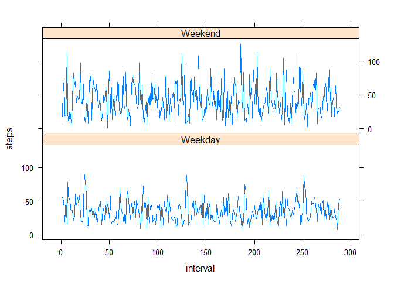

# Reproducible Research: Peer Assessment 1
Francisco Marco-Serrano  


## Loading and preprocessing the data


Load the data and group it per days and per intervals.


```r
# Datafile has to be present in the working directory
url = "./activity.csv"
activity.data = read.csv(url, header = TRUE, sep = ",")

# Group steps per day
daily.data = aggregate(x = activity.data$steps,
                       by = list(day = activity.data$date),
                       FUN = "sum")

# Average steps per interval across all days
finterval = factor(activity.data$interval)
interval.data = aggregate(x = activity.data$steps,
                          by = list(interval = finterval),
                          FUN = "mean", na.rm = TRUE)

# Rename grouped variables
names(daily.data)[2] = "steps"
names(interval.data)[2] = "steps"
```


## What is mean total number of steps taken per day?


Show how many steps are taken per day on average.


```r
# Histogram of the total number of steps taken each day
hist(daily.data$steps,
     main = "Histogram of total number of steps per day",
     xlab = "steps",
     ylab = "#days")
```

 

```r
# Average and median number of steps per day
mean(daily.data$steps, na.rm = TRUE)
```

```
## [1] 10766.19
```

```r
median(daily.data$steps, na.rm = TRUE)
```

```
## [1] 10765
```


## What is the average daily activity pattern?


Show the daily activity pattern through a time series plot and calculating the interval containing the maximum number of steps.


```r
# Plot the time series diagram of the average steps per interval
plot(x = interval.data$steps,
     type = "l",
     main = "Average number of steps per interval",
     xlab = "interval",
     ylab = "#steps")
```

 

```r
# Identify the interval in which average steps reach a maximum
as.integer(interval.data$interval[interval.data$steps == max(interval.data$steps)])
```

```
## [1] 104
```


## Imputing missing values

The missing values will be imputed.


```r
# Count the rows with NA values in the steps variable
sum(is.na(activity.data$steps))
```

```
## [1] 2304
```

```r
# Replace NA values with mean value for same interval across whole sample
library(plyr)

impute.mean = function(x) replace(x, is.na(x), mean(x, na.rm = TRUE))

# New dataset with imputed data
activity.imputed = ddply(activity.data, ~ interval,
                         transform, steps = impute.mean(steps))

# Group steps per day on the imputed dataset
daily.imputed = aggregate(x = activity.imputed$steps,
                          by = list(day = activity.imputed$date),
                          FUN = "sum")

# Draw histogram
hist(daily.imputed$x,
     main = "Histogram of total number of steps per day",
     xlab = "steps",
     ylab = "#days")
```

 

```r
# Average and median number of steps per day
mean(daily.imputed$x, na.rm = TRUE)
```

```
## [1] 10766.19
```

```r
median(daily.imputed$x, na.rm = TRUE)
```

```
## [1] 10766.19
```


As we can see, the value for the mean don't differ with the non-imputed data, while the ones for the median do change.


## Are there differences in activity patterns between weekdays and weekends?


```r
# Identify type of day: weekday/weekend
day.type = weekdays(as.Date(activity.imputed$date))

activity.imputed$day <- as.factor(ifelse(day.type %in% c("Saturday","Sunday"), 
                                         "Weekend", "Weekday"))

# Draw time series plot 
interval.imputed = aggregate(x = activity.imputed$steps,
                             by = list(interval = finterval,
                                       day = activity.imputed$day),
                             FUN = "mean", na.rm = TRUE)

# transform into integer so the x-scale of the diagram is right
interval.imputed$interval = as.integer(interval.imputed$interval)

library(lattice)

xyplot(interval.imputed$x ~ interval.imputed$interval | interval.imputed$day,
       data = interval.imputed, type = "l", layout = c(1, 2),
       xlab = "interval", ylab = "steps")
```

 
